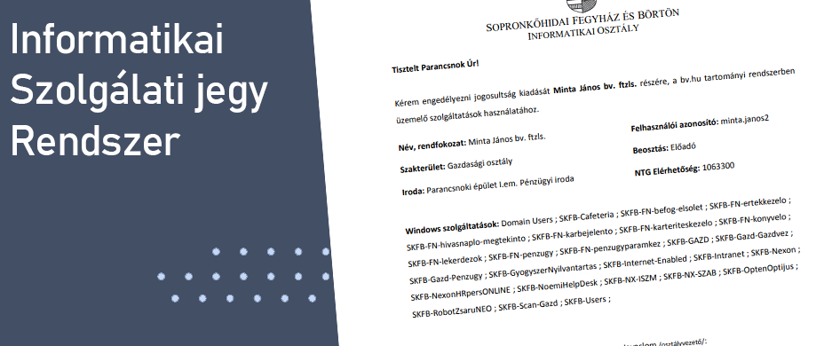

# Informatikai Szolgálati jegy Rendszer - Első verzió

Az `ISZR` első verziója amely C# nyelven írodott és Windows From alapokon működött.

Ebben a verzióban még nem voltak külön felhasználói profilok illetve adatbázisok a háttérben (ennek az oka, hogy nem voltak meg a technikai feltételek egy adatbázis létrehozásához a program megszületésekor)

Minden felhasználónak manuálisan be kellett írni minden elérhetőséget amely a felhasználóval kapcsolatos. Majd a rendszer a háttérben megnyította a Word-öt és behelyesítette az adott helyekre a bekért adatokat.

Az első verzió körülbelül 1,5 évig üzemelt majd át állt az új verziójú rendszerre.
